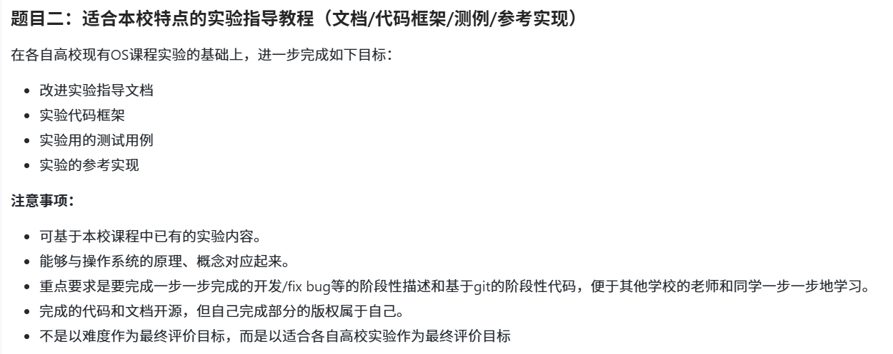

# RISCV-OS-Experiments-Guide 操作系统原理教学框架

本项目为 2025年全国大学生计算机系统能力大赛-操作系统设计赛-西北区域赛 参赛项目仓库。我们选择的赛题为 proj0-面向操作系统课程的操作系统竞赛和实验中的题目二。

位于根目录下的 `src` 文件夹作为公共代码库，存储了实验中题目涉及的所有代码。

## 项目摘要

本项目构建了一套循序渐进的操作系统实验教学体系，旨在解决传统操作系统课程中理论与实践脱节的教学痛点。不同于侧重裸机开发的传统内核构建课程，本框架采用“系统编程为引，内核机制为本”的教学范式，引导学习者在 Linux 环境下通过 POSIX 标准接口深入剖析操作系统的核心子系统。项目严格对应操作系统的关键抽象层次，从基础环境构建开始，依次深入存储管理、文件系统、进程生命周期、多线程并发模型以及进程间通信机制。所有的实验代码均基于 C 语言编写，并严格遵循 Linux 系统调用规范，旨在通过具有实际工程意义的代码实现，将抽象的操作系统概念转化为可视化的运行逻辑。

## 教学理念与方法论

本课程体系的设计遵循从具象到抽象、从单体到协同的认知规律。教学路径首先立足于基础环境的认知，随后过渡到对计算机核心资源，即内存与文件的管理，进而深入至动态进程的生命周期控制与多线程并发领域，最终以多进程协作通信收尾。项目特别强调实证研究的重要性，要求学习者不仅要编写代码，更要利用系统监控工具观测运行状态，从而验证理论模型的正确性。

## 实验模块详述

### 实验一：初步了解 Linux

作为整个课程体系的基石，本模块致力于构建标准化的操作系统实验环境。学习者将在此阶段安装 Linux， 并熟悉 Linux 命令行界面的交互逻辑。

### 实验二：存储管理

本模块聚焦于操作系统中最核心的资源管理机制之一——内存管理。

本模块立足于操作系统存储管理的核心理论与实践应用，通过对虚拟内存映射、内存安全隔离、页面置换算法模拟以及内存映射优化等关键技术的深度拆解，系统地展示了操作系统如何高效利用并保护有限的物理内存资源。通过该模块的学习，学习者将深入理解虚拟存储技术在突破硬件瓶颈、解决地址冲突及强化系统安全方面的核心作用，熟练掌握动态内存管理与高效文件 I/O 的实现手段，并能够运用系统观测工具与置换算法模型，对复杂的内存运行状态进行精细化分析与性能优化，从而构建起从底层机制到高层应用的完整存储管理知识体系。

### 实验三：文件系统

在此模块中，教学重点转向操作系统对外部持久化存储设备的抽象管理。学习者将深入理解 Linux “一切皆文件” 的设计哲学。

### 实验四：进程管理

进程是操作系统资源分配的基本单位，本模块将通过代码实现对进程全生命周期的控制。学习者将从零开始认识进程，管理进程状态，从而掌握进程系统调用以及对进程生命周期的管理。此外，进阶实验引入了 Linux 特有的克隆系统调用，指导学习者通过操纵 PID 命名空间来构建轻量级的容器隔离环境。模块还包含算法导向的任务，要求利用递归逻辑在内核中构建二叉进程树。

### 实验五：进程间通信与管道实验

本模块聚焦于操作系统进程间通信（IPC）的核心机制，以管道技术为切入点，系统展示了数据在独立进程空间之间高效流转与协同工作的关键逻辑。通过本模块的学习，学习者将深入理解内核如何通过缓冲区打破进程间的“信息孤岛”，掌握无名管道与有名管道在不同应用场景下的构建方法，并能熟练运用相关系统调用解决进程同步、标准 I/O 重定向及复杂双向通信等实际问题，从而在保证地址空间隔离与系统安全的前提下，构建起高效、协同的多进程软件架构。

### 实验六：多线程编程

为了解决多进程模型在通信效率与资源开销上的瓶颈，操作系统引入了轻量级执行单元——线程。实验首先通过对比测试，从实证角度验证了线程间共享地址空间而进程间内存隔离的本质区别。随后，课程深入探讨并发编程中的核心难题，即竞态条件与数据非一致性问题。学习者需通过编写高并发计数器程序复现原子性破坏的场景，并引入互斥锁机制来重建临界区的原子性。此外，本模块还涵盖了死锁成因分析与哲学家就餐问题，探讨资源有序分配与信号量限流等高级同步策略。

